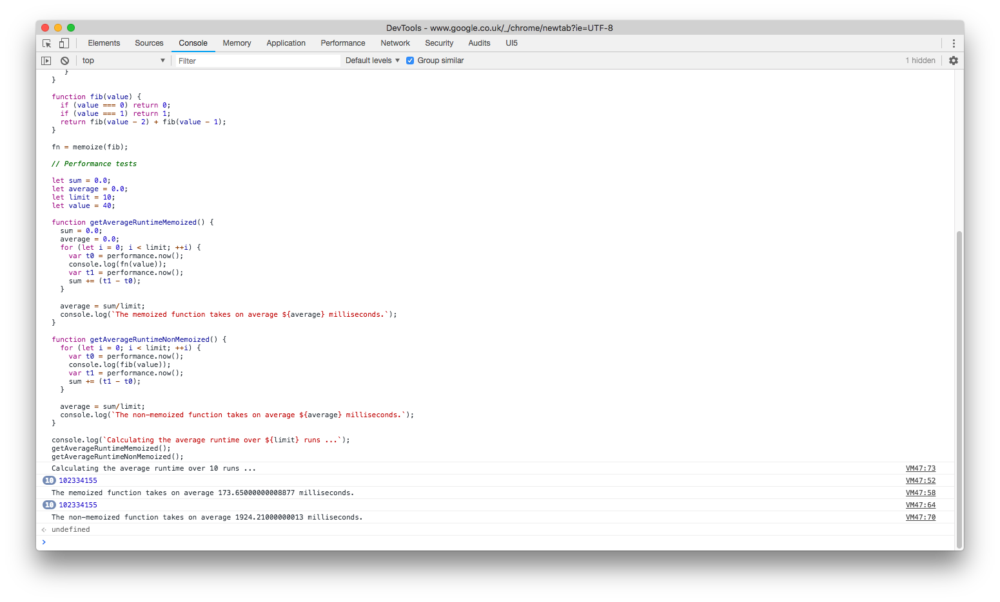

# Memoization

Memoization is a useful technique for functions that are called repeatedly with the same set of inputs, but whose result is relatively expensive to produce. NOTE: Only pure functions can be memoized. Memoization does not works for impure functions,  because if the function does not return same value for the same input, the returned cached value will not be the required result. It’ll make more sense when we memoize some stuff.

Based on: https://taylodl.wordpress.com/2012/06/13/functional-javascript-memoization-part-i/

 

  

