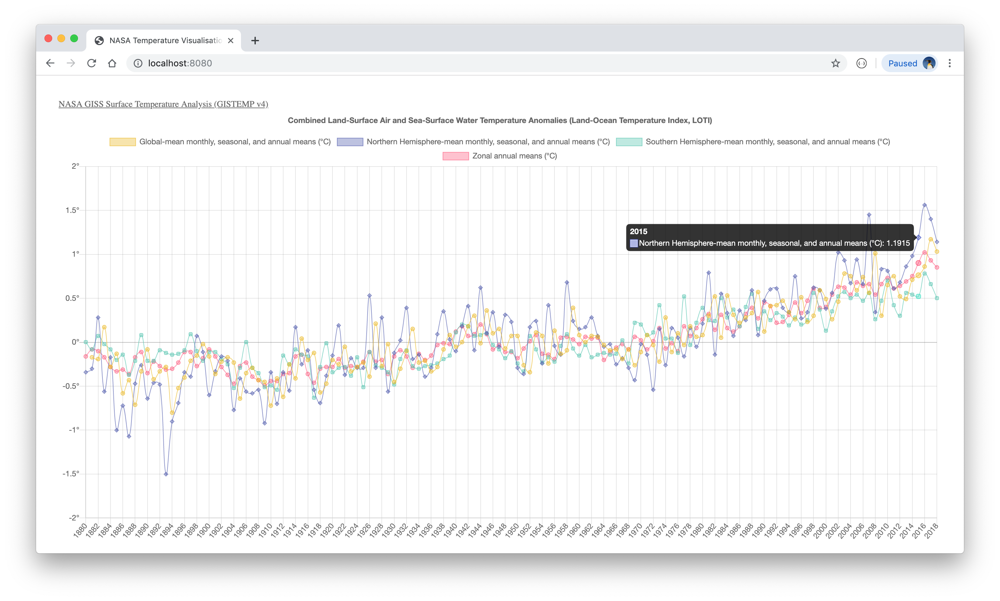

# NASA GISS Surface Temperature Visualisation

A visualisation of global temperature anomalies (deviations from the corresponding 1951-1980 means), based on temperature information provided by NASA GISS, for the period 1880 to 2018. The graph illustrates the following temperature curves (measured in °C):

* Global-mean monthly, seasonal, and annual means.
* Zonal annual means.
* Northern Hemisphere-mean monthly, seasonal, and annual means.
* Southern Hemisphere-mean monthly, seasonal, and annual means.

Based on Daniel Shiffman's Coding Train video example:https://www.youtube.com/watch?v=5-ptp9tRApM.

Resources:
* Temperature data obtained from: https://data.giss.nasa.gov/gistemp/.
* Chart library: https://www.chartjs.org.

  

